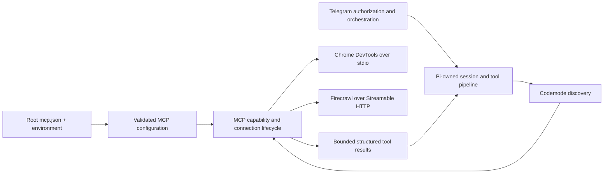

# Sumire bot MCP support

## Goal

讓 Sumire bot 從根目錄 `mcp.json` 載入 MCP servers，支援 stdio 的 Chrome DevTools 與 Streamable HTTP 的 Firecrawl。模型能探索並呼叫 MCP tools；呼叫沿用 Pi 的工具執行管線、Telegram 的授權與取消機制，不新增 agent loop。

實作已完成核心整合、測試、文件與 Firecrawl live smoke；目前仍有 Chrome sandbox 部署阻礙，不能宣告計畫 end-to-end 完成。計畫保留。GitHub push 已成功，依使用者要求建立非 Draft [PR #77](https://github.com/narumiruna/sumire/pull/77)，Chrome 驗收仍未完成。

## Context

- `apps/bot/package.json` 宣告 Pi packages 與 `pi-durable` 為 `1.0.2`。
- `apps/bot/src/agent/pi-session-factory.ts` 使用 `Harness`、`DurableSession` 與靜態 `nativeTools`；`DefaultResourceLoader` 設定 `noExtensions: true`。
- `apps/bot/src/agent/durable-codemode.ts` 使用靜態工具 Map，`getNamespace()` 固定回傳 `undefined`，目前無 MCP discovery 或動態工具更新。
- Pi 的 `docs/mcp.md`、`docs/sdk.md` 與 `examples/sdk/14-codemode-mcp.ts` 說明：SDK 必須明確載入 `createMcpExtension()`，並由 `session.bindExtensions()` 啟動連線。預設 exposure 是 `codemode`。
- Pi 預設讀取 agent directory 的 `mcp.json` 與受信任專案的 `.pi/mcp.json`，不會自動讀取本計畫的根目錄 `mcp.json`。公開 `McpExtensionOptions.loadConfig` 可覆寫設定來源，但它需要真正的 extension context。
- 根目錄 `AGENTS.md` 要求 `AgentSession` 擁有 model turn 與工具 loop；目前 durable runtime 與此規則存在差異，必須在整合前釐清，不能假裝 SDK 範例可直接套用。
- 初始檢查的 `node_modules` 未找到 `pi-durable`；實作前已執行 `npm ci` 並驗證公開 exports。
- `compose.yaml` 使用 `/workdir` 作為可寫工作目錄；設定與 runtime resources 位於 `/app`。Docker 已包含 Playwright Chromium，但不能據此假設 Chrome DevTools MCP 能自動找到或啟動它。

## Runtime decision and evidence

- `npm ci` completed; installed Pi packages are `1.0.2`. `main` matched `origin/main`; implementation branch is `narumi/feat/mcp-support`.
- `apps/bot/AGENTS.md` is the narrower applicable boundary: keep `Harness` as the sole agent runtime. No SQLite migration or second `AgentSession` is required.
- Public `@earendil-works/pi-mcp@1.0.2` exports `McpClient`, `StdioTransport`, `StreamableHttpTransport`, `toLlmContent` and test transports. Use these as a capability bridge through durable tools; do not import coding-agent's private MCP runtime.
- Real fake stdio and Streamable HTTP prototype tests pass. Session tests prove namespace discovery, direct/codemode dispatch and process-crash recovery without replaying direct or nested MCP side effects.
- A lifecycle regression test found Pi 1.0.2 drops the stdio process-group pid after an unexpected leader exit. `ManagedStdioTransport` retains the public pid and cleans the group; its regression test passes.

## Architecture

### Configuration contract

- 新增 `BOT_MCP_ENABLED=false` 與 `BOT_MCP_CONFIG_PATH`。預設路徑從 repository/application root 解析為 `mcp.json`，不從 `BOT_WORKDIR` 尋找。
- MCP 關閉時不讀取設定、不啟動 subprocess、不發出 MCP 網路請求；既有 bot 行為不變。
- 啟用時只讀取明確指定的管理員設定，不合併工作目錄或使用者 home 的 MCP servers，也不自動載入任意 extensions。
- 啟用但檔案不存在或頂層 JSON 無效時，啟動失敗並提供去敏錯誤。單一 server 設定錯誤、缺少環境變數或連線失敗時，停用該 server，其餘 server 與 bot 繼續工作。
- 支援 `command`、`args`、`env`、`cwd`、`url`、`headers`、`description`、`enabled`、`timeout` 與 exposure 設定；用 schema 驗證 transport 互斥與名稱碰撞。第一版支援 `codemode`、`direct`、`hidden`；明確拒絕尚未實作的 `deferred`，不能靜默降級。
- `${NAME}` 由程序環境解析，缺值不得原樣傳送；不支援 `!command` 的 credential shell expansion。stdio 使用 executable + args，不拼 shell command。
- 根目錄 `mcp.json` 保留使用者提供的兩個 server 與 `${FIRECRAWL_API_KEY}`。不寫入真實 token；私有設定改用指定的 ignored 檔案，不放私人 URL 到 tracked configuration。

### Tool and lifecycle contract

- 優先使用 Pi 公開 MCP extension/API，不 import 未公開的內部 MCP runtime，不用假造 `ExtensionAPI` 啟動完整 MCP extension。
- MCP 預設 exposure 為 `codemode`。`BOT_MCP_ENABLED=true` 時啟用 discovery 所需的 codemode，即使 `BOT_CODEMODE_ENABLED=false`；MCP 關閉時保留原 codemode flag 行為。文件與設定測試必須寫清此優先序。
- 模型透過 `searchTools()`、`describeTool()`、`describeNamespace()`、`ALL_TOOLS` 找工具，system prompt 提供有界的 server 摘要。名稱遵循 Pi 的 `mcp__<server>__<tool>` 正規化及碰撞處理。
- 每個 chat session 擁有自己的 MCP connections、stdio process 與 browser profile，不共享 Chrome browsing state。session disposal 與啟動失敗路徑都關閉連線、清除 subprocess；資源使用量以測試與部署 smoke 驗證。
- 工具目錄是動態來源：連線完成、斷線、重連、tool-list change 與移除必須同步至 discovery 與 dispatch；已移除工具不可透過舊 Map 呼叫。
- 所有 direct 與 codemode nested calls 都通過相同的授權、取消、deadline、事件與結果管線。保留 `parentToolCallId`；`update_progress` 與 `read_image` 繼續 model-only。
- 保存 MCP `content`、`structuredContent` 與 `isError`。文字與 binary/image 結果有明確輸出、儲存與傳送上限，不以 `jsonValue()` 吞掉不支援的 content。結果視為不可信資料。
- 副作用工具不得因網路錯誤或程序重啟自動重送；若保留 durable storage，必須在執行前持久化不可重播意圖，重啟後回報 interrupted，要求檢查副作用。

## Plan

- [x] **確認公開整合 API 與 runtime 邊界。** 執行 `npm ci`，檢查實際安裝的 Pi 與 `pi-durable` exports、MCP extension lifecycle、tool loadout、取消與結果型別；以本地 fake stdio/HTTP servers 驗證最小 prototype。先記錄符合 `AGENTS.md` 的 runtime 決策：若需回到 `AgentSession`，先提出獨立 migration scope 與 SQLite session recovery 策略供確認；若有可用的公開 capability bridge，也須確認現有 runtime 邊界合規。不得在未解決此問題時以第二個 `AgentSession`、完整 mock extension context 或自製 agent loop 規避。驗收：確定可執行的公開 API 路徑，以及聊天復原與 side-effect replay 測試策略。
- [x] **實作 MCP 設定載入與驗證。** 在 `apps/bot/src/config/settings.ts` 加 flags；新增聚焦於 schema、環境插值與去敏錯誤的 MCP config module，更新 `.env.example`。驗收：測試 disabled、路徑解析、缺檔、錯誤 JSON、缺少 key、invalid transport/name、collisions、unsupported exposure、禁止 credential command expansion 與多 server 部分失敗；提供的 `mcp.json` 可成功解析。
- [x] **建立每 chat 的 MCP capability lifecycle。** 依第一步確認的公開 API，在 session factory 建立 MCP capability，將連線、tool-list 更新與 cleanup 接入 session disposal；設定 cwd、stdio env、request timeout 與 bounded startup wait。驗收：fake servers 測試兩 chats 隔離、延遲啟動、單 server 失敗、斷線重連、工具更新、初始化失敗 cleanup、SIGTERM cleanup 與 process group 無殘留。
- [x] **接入動態工具探索與執行。** 更新 runtime tools 與 codemode loadout/dispatch，不再捕捉 MCP 靜態 snapshot；提供 namespace metadata、有界 server prompt section、exposure 與 codemode flag 優先序。驗收：透過 fake MCP tool 執行搜尋、namespace 描述、direct call、nested call、hidden rejection 與 withdrawn-tool rejection；不影響既有 coding tools 與 model-only tools。
- [x] **補齊取消、結果、復原與安全測試。** 沿用 Telegram 白名單與 session ownership，將 abort/deadline 傳入 transport，測試完整 MCP content 與 `isError` 語意、文字截斷、image bounds、資源工具的存取界線與 log redaction。驗收：取消後不再派發新 calls；呼叫開始後 crash/restart 不重播副作用；log、progress 與 transcript 不含 headers、token 或解析後設定。第一版若不支援 MCP resources，文件明確標示並保持不可達。
- [ ] **驗證 Chrome DevTools 與 Firecrawl 的部署條件。** `compose.yaml` 以唯讀 mount 將根目錄 `mcp.json` 放到 `/app/mcp.json`，不放入 `/workdir`。檢查 Chrome DevTools MCP 的當前文件、Node requirement、Chromium executable/headless options、non-root sandbox、browser profile 與子程序清理；用獨立 smoke override 指向容器可用 Chromium，必要時調整 Dockerfile，不預設加入 `--no-sandbox` 或 privileged mode。驗收：repository root 執行 Docker Compose smoke，Chrome 開啟公開測試頁並讀取頁面/截圖，Firecrawl 使用 runtime key 完成一次低成本 search 或 scrape；記錄 `@latest` 的實際版本、平台與 browser args。若有憑證或 Docker 不可用，保留此項未完成並記錄所需外部條件。
- [x] **更新操作文件與 changeset。** 更新 `apps/bot/README.md` 與必要的根 README，說明 MCP enable/path、codemode 優先序、`${FIRECRAWL_API_KEY}`、server failure、restart-to-reload、Chrome local/Docker 差異、timeout 與安全界線。此次計畫 PR 使用 empty changeset；實作 PR 至少 bump 私有 bot package，若修改共享 package 也列入。驗收：文件命令與實際設定相符，沒有宣稱尚未實作的 deferred、OAuth 或資源功能。
- [ ] **執行完整驗證與交付 review。** 迭代使用 bot workspace tests；TypeScript 實作完成後從根目錄執行 `npm run format:check`、`npm run lint`、`npm run typecheck`、`npm test`、`npm run build`。驗收：checks 通過，Docker smoke 與雙 chat 測試有證據；不可執行的 checks 明確保留，不宣告實作完成。

## Review ledger (PR #80)

Confirmed the current branch belongs to `narumiruna/sumire` and maps to open PR #80 at `2536bdf`. Read its description, complete diff, sole commit, checks, submitted review, all REST comment/conversation pages and the sole GraphQL thread/comment page (no remaining pages). Relevant instructions and previous implementation evidence are unchanged. The automated review boilerplate and activity-summary comment contain no additional feedback items. Original CI run `37734068006` passed.

| Item | Independent evidence and scope | Severity | Outcome |
| --- | --- | --- | --- |
| [Short Basic components](https://github.com/narumiruna/sumire/pull/80#discussion_r4215327851) | PR #80 adds decoded `a`/`b` to global substring alternatives for `a:b`. `mcpPresentationSchema` compares structural strings after redaction, so `object` changes and the tool is withheld. Repeating unrelated words also expands result text unnecessarily. Directly introduced by this PR, preventing its Basic-auth goal. | P2 | Implemented and validated on the PR branch; publication/thread disposition recorded in the linked thread. Derived components up to three Unicode code points now use Unicode letter/mark/number/underscore boundaries; full pairs and longer/explicit secrets retain substring matching. Both match classes share count/byte limits and a longest-first single replacement pass. Config/redactor tests verify explicit-secret precedence, combined budgets, Unicode boundaries and a 600 KB non-expanding result. Real HTTP `a:b` verifies the unchanged wire header, published object-schema tool, redacted instructions/descriptions and successful result dispatch. Root gates passed (1,116 tests); 110 focused tests passed. No deferred items or clarification requests. The original Chrome deployment acceptance blocker is unchanged and is not addressed by this configuration fix. |

## Review ledger (PR #77)

Post-merge Basic-auth pass: confirmed repository identity, fetched latest `origin/main` and created `narumi/fix/mcp-basic-auth-redaction` from merge `fb6a326`. PR #77 is now merged at unchanged head `884ae47`; its complete diff, instructions, prior 27 ledger entries and published replies remain unchanged and are reused. Retrieved all REST comment pages and all 28 GraphQL threads (no additional thread/comment pages), the submitted reviews, conversation, commits and checks. The original head's `typescript` check passed in run `37732985172`. One new P2 item is independently verified below. No duplicate replies or repeated validation for previously resolved items. The unchanged Chrome sandbox acceptance blocker remains open; no deployment changes are made by this follow-up.

| Item | Independent evidence and scope | Severity | Outcome |
| --- | --- | --- | --- |
| [Decoded Basic credentials](https://github.com/narumiruna/sumire/pull/77#discussion_r4215241061) | `mcp-config.ts` recorded only the wire header and Base64 payload. Decoded usernames/passwords/colon pairs were absent from the redactor, despite PR #77's configured-credential redaction contract. | P2 | Implemented on `narumi/fix/mcp-basic-auth-redaction`; publication and thread disposition are recorded in the linked GitHub thread. Record canonical Base64/UTF-8 decoded pairs and nonempty components, splitting at the first colon, through existing count/byte budgets. Preserve wire headers and skipped-entry isolation. Ten config cases and an added real HTTP Basic case cover component echoes in initialization instructions, tool metadata and results, mixed case/whitespace, Unicode, empty components, colon-containing passwords, malformed input and budget overflow. All root checks passed (1,112 tests), as did the 101 focused configuration/capability tests, `git diff --check` and changeset status. The other 27 findings remain already addressed with their evidence and resolutions below; none deferred or requiring clarification. The new thread may be resolved only after push and follow-up PR publication. |

Credential/deadline pass: matched the same checkout and open PR at `2165960`; instructions, commits and previously reviewed full diff were unchanged. Retrieved all new reviews, inline/conversation comments and thread pages. Independently verified three in-scope P2 findings and fixed them in `26b2116`, then validated, published, replied and resolved. Root gates passed (1,101 tests, 198 MCP), production build/live Firecrawl smoke passed, and Linux CI `37732809721` passed. All 27 inline threads are resolved; no deferred items or clarification requests. Chrome acceptance remains blocked by sandbox-capable deployment.

Lifecycle/resource pass: checkout and open PR matched `362a9a7`; instructions, commits and previously reviewed full diff were unchanged. Fetched all new feedback/review/thread pages and independently verified six in-scope P2 findings. Fixes `76df296` are published with evidence-backed replies; all 24 inline threads are resolved. Root gates passed (1,086 tests, 183 MCP), production image/live Firecrawl smoke passed, and crash-recovery tests now verify home cleanup plus preserved results. Linux CI twice exposed the general crash fixture's four-second startup guard under expanded integration load; test-only fix `1d107de` retained all semantic assertions and Linux CI `37730732656` passed. No deferred items or clarification requests. Full Chrome acceptance remains blocked by unchanged sandbox deployment requirements.

Configuration limits pass: matched the same checkout and open PR at `86d047e`; instructions and complete previously reviewed diff were unchanged. Fetched all new inline/thread pages, reviews, conversation activity and the failed CI log. Four new findings and the CI race were independently verified as in-scope P2 defects and fixed in `9226215`. Root gates passed (1,065 tests, 162 MCP), five focused stale-handle repeats passed, production image/live Firecrawl smoke passed, and Linux CI `37727744393` passed. All eighteen inline findings have published replies and resolved threads. No deferred items or clarification requests; Chrome acceptance remains blocked by sandbox deployment.

Resource/configuration pass: repository and checkout matched the open PR at `4edfc76`; instructions, diff and eleven resolved findings were unchanged. Reused prior evidence and fetched all new feedback/thread pages. Three additional in-scope P2 findings were independently verified, fixed in `bdf564f`, validated, published, replied to and resolved. Root gates passed (1,028 tests, 125 MCP), as did rebuilt-image Firecrawl smoke. No deferred items or clarification requests; Chrome acceptance remains blocked by the unchanged sandbox requirement.

Timeout review pass: checkout/repository/PR matched; PR was open at `8e63498`, with unchanged instructions/diff and nine resolved findings. Reused that evidence, fetched all thread/comment pages, and independently verified two new in-scope P2 defects against the config, Node fetch lifetime and public Pi transport. Both fixes were validated and published in `1e99ef1`, replied to and resolved. Root checks passed with 1,007 tests (104 MCP), and rebuilt-image Firecrawl smoke passed. No deferred items or missing decisions; the prior Chrome deployment blocker remains unchanged.

Latest repeat inspection: repository/checkout still match and PR remained open at `5e0fc08`. Instructions, implementation diff and seven resolved findings were unchanged and reused. Fetched all feedback/thread pages and reviewed the two new findings against their source and Pi's public transport behavior. Both were in-scope P2 defects, fixed and published in `ca65abf`. Full root checks passed (996 tests, 93 MCP tests); the rebuilt production image passed live Firecrawl smoke. Replies and resolutions were published without repeating previous replies. Chrome acceptance remains blocked by the unchanged deployment sandbox restriction.

Repeat inspection: checkout/remote/PR repository match, PR remains open at `61a9cf1`, and instructions/commits/diff/checks are unchanged (CI green). Reused prior verified material and resolved outcomes without duplicate replies or repeated validation. Three new inline findings and a new review were fetched with every thread/comment page; their relevant code was independently reread. The existing Chrome blocker has no new deployment evidence.

The checkout and PR both belong to `narumiruna/sumire`; head `7711561` matches the previously reviewed implementation. Reused the unchanged complete diff and verification evidence; reread relevant source and public Pi client APIs. All REST feedback pages and all GraphQL thread/comment pages were fetched (no remaining pages). The defect evidence below describes that inspected head; all four fixes were subsequently validated and published, and each thread received an evidence-backed reply and was resolved. CI `typescript` passed on the inspected head `7711561`; review-fix head checks are tracked separately in the PR.

| Item | Independent evidence and scope | Severity | Outcome |
| --- | --- | --- | --- |
| [Stale raw identity](https://github.com/narumiruna/sumire/pull/77#discussion_r4209873151) | Dispatch checks only normalized names, so replacing `a-b` with `a_b` admits an old wrapper. Introduced by this PR's dynamic registry; violates withdrawn-tool protection. | P2 | Already addressed in `52c6a74`; validated, published, replied and resolved: wrapper identity plus client generation guards reject `a-b` → `a_b` snapshots; replacement dispatch succeeds in the real stdio regression. |
| [Cumulative discovery limits](https://github.com/narumiruna/sumire/pull/77#discussion_r4209873165) | Public Pi 1.0.2 `listTools` calls `listAll`, accumulating up to 1,000 pages before returning. Current bounds run afterward. Introduced by this PR; can exhaust shared bot memory. | P1 | Already addressed in `52c6a74`; validated, published, replied and resolved: public `request` fetches one validated page at a time with cumulative 1,024-tool / 8 MB caps and one absolute signal. Tests prove no third request after either bound, and reject malformed pages, duplicate names/cursors and cancellation. |
| [Custom auth header redaction](https://github.com/narumiruna/sumire/pull/77#discussion_r4209873173) | Config's credential-name predicate excludes literal `X-Auth`; environment interpolation does not protect literals. Violates this PR's configured-credential redaction contract. | P2 | Already addressed in `52c6a74`; validated, published, replied and resolved: auth-style names and scheme payloads are classified as credentials. Config matrix plus real HTTP `X-Auth` checks cover wire preservation and redaction of instructions, descriptions and results. |
| [Raw definition preservation](https://github.com/narumiruna/sumire/pull/77#discussion_r4209873183) | Recursive redaction changes raw names, schema keys and enum values before dispatch/validation. Introduced by this PR; protocol data must not be rewritten as presentation text. | P2 | Already addressed in `52c6a74`; validated, published, replied and resolved: raw definitions remain unchanged, opaque public aliases dispatch the original name, and safe schemas retain structural semantics. Sensitive structural keys/enums/constants/references are withheld, not rewritten or exposed; six schema tests and real stdio alias/withholding tests pass. |
| [Nested task wrapper identity](https://github.com/narumiruna/sumire/pull/77#discussion_r4213548954) | At `61a9cf1`, the durable codemode task persists only a normalized name and reselects the current wrapper, bypassing the direct identity guard. This PR exposes dynamic replacement to existing nested dispatch. | P2 | Already addressed in `9db4c22`; validated, published, replied and resolved: nested inputs persist an opaque generation selected from the script snapshot; dispatch verifies the current generation before invocation. A real durable-session regression rejects the retained handle without replacement effects, then a fresh script succeeds. |
| [Result envelope redaction](https://github.com/narumiruna/sumire/pull/77#discussion_r4213548959) | `shapeMcpResult` recursively redacts keys/type before interpreting content and removes `_meta` afterward; structural-term credentials break content/error semantics and metadata omission. Introduced by this PR. | P2 | Already addressed in `9db4c22`; validated, published, replied and resolved: explicit protocol projection omits metadata before redaction, preserves keys/discriminants/error flags, and redacts payloads separately. Seventeen result tests cover structural-term credentials, metadata omission, false/absent flags and fail-closed malformed/binary/MIME metadata. |
| [Empty opaque cursor](https://github.com/narumiruna/sumire/pull/77#discussion_r4213548965) | The page schema and public cursor type accept empty strings but the falsy termination test drops later pages. Pi's empty-as-end tolerance is not a reason to discard a supplied opaque cursor in this adapter. Introduced by this PR's bounded discovery. | P2 | Already addressed in `9db4c22`; validated, published, replied and resolved: only nullish cursors end discovery. Regressions fetch the second page with `{ cursor: "" }` and reject a repeated empty cursor. |
| [Skipped server collisions](https://github.com/narumiruna/sumire/pull/77#discussion_r4213998545) | At `5e0fc08`, name counts include every raw entry before validation/enabled checks; unusable `a_b` suppresses valid `a-b`. Introduced by this PR; violates independent per-server validation. | P2 | Already addressed in `ca65abf`; validated, published, replied and resolved: collision counts now use fully validated enabled candidates after environment expansion. Regressions preserve the healthy server in either entry order for disabled, malformed and missing-environment collisions; genuine enabled collisions remain rejected. |
| [SSE media type casing](https://github.com/narumiruna/sumire/pull/77#discussion_r4213998551) | Adapter uses case-sensitive substring matching; public Pi transport normalizes the exact media type with split/trim/lowercase. Valid mixed-case SSE therefore gets an erroneous cumulative stream cap. Introduced by this PR's body limiter. | P2 | Already addressed in `ca65abf`; validated, published, replied and resolved: adapter matches the normalized exact media type, like public Pi. Casing/parameter tests and public-transport regressions accept nine 1 MB events plus a response, reject a single oversized event, and retain non-SSE body bounds (including misleading substring media types). |
| [Standalone SSE deadline](https://github.com/narumiruna/sumire/pull/77#discussion_r4214112308) | At `8e63498`, every fetch signal includes a request timeout that remains attached to the body. Public Pi opens a persistent GET notification stream with its transport-owned signal, so this PR disrupts healthy notification delivery at each timeout. | P2 | Already addressed in `1e99ef1`; validated, published, replied and resolved: clearable deadlines release only successful SSE GET bodies after bounded headers. Five actual Node-fetch lifecycle tests verify late notifications without reopening, shutdown and caller cancellation, stalled headers, POST body deadlines and GET error-body deadlines. Pi's existing per-event regressions remain green. |
| [Fractional timeout precision](https://github.com/narumiruna/sumire/pull/77#discussion_r4214112314) | Config accepts positive fractional seconds, while calls pass fractional milliseconds to Node `AbortSignal.timeout`, which requires integers; HTTP uses the same conversion. Introduced by this PR. | P2 | Already addressed in `1e99ef1`; validated, published, replied and resolved: config computes `timeoutMs` once using ceiling with a 1 ms minimum; initialization, HTTP and call deadlines all use it. Five precision/boundary cases and real stdio/HTTP fractional-timeout dispatch pass. |
| [Finite HTTP deadline cleanup](https://github.com/narumiruna/sumire/pull/77#discussion_r4214252023) | At `4edfc76`, bodyless responses and finite-body EOF/cancellation do not clear the explicit timer/listener. Introduced/worsened by the prior clearable deadline change; busy HTTP clients retain unnecessary lifetime state. | P2 | Already addressed in `bdf564f`; validated, published, replied and resolved: finite-body reader ownership clears deadline timers/listeners and releases locks on EOF, cancellation or failure; bodyless responses clear immediately. Eight completion/failure cases assert zero timers/listeners and no delayed abort, plus an active-body test retains its deadline. Node-fetch lifecycle and Pi per-event bound tests remain green. |
| [Bound configuration reads](https://github.com/narumiruna/sumire/pull/77#discussion_r4214252025) | `readFile` allocates the complete file before the 1 MB check. Introduced by this PR's loader; an administrator path mistake can cause startup memory exhaustion. | P2 | Already addressed in `bdf564f`; validated, published, replied and resolved: focused file reader validates a regular descriptor and early size, then reads at most 1,000,001 bytes in a fixed buffer, closing on every path. Six mocked I/O regressions cover short UTF-8 reads, exact bounds, oversized stat, post-stat growth, non-regular files and I/O failures; loader tests cover real exact/overflow files. |
| [Skipped-entry secret isolation](https://github.com/narumiruna/sumire/pull/77#discussion_r4214252029) | Expansion mutates global secrets before later fields can fail, and before collision rejection. An unused value such as `object` can withhold a healthy schema. Exposed by this PR's global redaction and per-server isolation goal. | P2 | Already addressed in `bdf564f`; validated, published, replied and resolved: credential sets remain entry-local until full expansion and collision filtering succeed. Environment/header failure, disabled and collision matrices preserve active redaction without unused values. Real stdio regressions show unused `echo` does not alias names and unused `object` does not withhold healthy schemas. |
| [Credential name boundaries](https://github.com/narumiruna/sumire/pull/77#discussion_r4214499718) | At `86d047e`, substring matching treats `MONKEY=object` and `AUTHOR` as credentials, contaminating healthy schemas/names. Introduced by this PR's name-based redaction. | P2 | Already addressed in `9226215`; validated, published, replied and resolved: shared deterministic classifier uses delimited/camel-case words and explicit combined forms. Twenty-six classifier cases preserve auth/cookie/key variants and reject ordinary substring names; real two-server MONKEY/AUTHOR coverage preserves names and schemas. |
| [URL query credentials](https://github.com/narumiruna/sumire/pull/77#discussion_r4214499722) | Validated URLs accept query credentials not added to redaction; echoed endpoints can leak them. Introduced by this PR's HTTP configuration. | P2 | Already addressed in `9226215`; validated, published, replied and resolved: URL validation rejects query credential names through the shared classifier. Seven cases include casing, camel-case and percent-encoded keys; ordinary author/project queries and existing header authentication remain supported without sensitive diagnostics. |
| [Server name length](https://github.com/narumiruna/sumire/pull/77#discussion_r4214499735) | Regex-valid names have no length bound and are duplicated in every wrapper/name calculation up to 1,024 tools. Introduced metadata amplification defeats the file byte cap. | P2 | Already addressed in `9226215`; validated, published, replied and resolved: names over 64 ASCII characters are skipped before expansion. Boundary and 500 KB name cases leave the healthy maximum-length name available. |
| [Configured server count](https://github.com/narumiruna/sumire/pull/77#discussion_r4214499741) | The 1 MB file cap admits thousands of entries; chat startup opens all concurrently. Introduced by this PR's capability registry. | P2 | Already addressed in `9226215`; validated, published, replied and resolved: more than 16 total entries fails loading with a generic bounded error. Boundary tests accept 16 and prove overflow never evaluates an environment getter; README documents disabled entries count toward the cap. |
| CI stale-handle regression | Run `37725476608` failed only the retained-handle assertion: the script raced registry refresh, invoking a withdrawn raw name before publication and receiving a protocol failure instead of the generation guard. This PR introduced the timing-dependent test. | P2 | Already addressed in `9226215`; validated and published: the same script retains its handle but waits at a base-Bash gate; the test releases it only after a new direct-tool marker is publicly registered. Exact stale rejection, zero replacement effects and fresh invocation success remain asserted. Five focused repeats and the full suite pass; Linux CI `37727744393` passed after publication, including the previously failing assertion. |
| [Auth payload whitespace](https://github.com/narumiruna/sumire/pull/77#discussion_r4214753972) | Auth extraction stores whitespace before a parsed token, so standalone echoes evade redaction. Introduced credential handling is in scope. | P2 | Already addressed in `76df296`; validated, published, replied and resolved: normalized scheme payload extraction preserves configured/wire headers while redacting parsed tokens. Four auth variants cover leading/trailing whitespace and mixed separators; real HTTP uses a literal multi-space Bearer header and verifies redacted metadata/results. |
| [Exposure pattern work](https://github.com/narumiruna/sumire/pull/77#discussion_r4214753985) | Each lookup recompiles every wildcard; the file byte bound admits excessive synchronous work. Introduced discovery/configuration is in scope. | P2 | Already addressed in `76df296`; validated, published, replied and resolved: accepted maps contain at most 64 patterns of at most 128 characters. WeakMap-cached literal segments replace per-lookup regex compilation/backtracking. Boundary tests and ten matching cases retain exact precedence, ordered wildcard matching, literal punctuation and non-overlapping segments. |
| [Opening readiness](https://github.com/narumiruna/sumire/pull/77#discussion_r4214753991) | Connected state precedes the awaited initial refresh; `open` bypasses its pending opening promise. Introduced readiness is in scope. | P2 | Already addressed in `76df296`; validated, published, replied and resolved: opening promises precede connected-state short circuits. A real stdio server gates its first directory response after initialization; after a cancelled initial waiter, the second ready stays pending until publication and returns populated tools. |
| [Post-redaction metadata](https://github.com/narumiruna/sumire/pull/77#discussion_r4214754001) | Redaction expands namespace/annotations; per-wrapper namespace recreation and missing presentation bounds amplify retained data. Introduced metadata shaping is in scope. | P2 | Already addressed in `76df296`; validated, published, replied and resolved: namespaces are shared per publication and prose clipped to 4,096 characters. Annotation serialized bytes are checked before/after redaction; oversized annotations are omitted. Schema prose and total schema bytes are bounded; cumulative wrapper metadata including namespaces stays within 8 MB per server. Real 1,024-tool redaction expansion verifies excess tools are withheld, and unit tests verify annotations/prose bounds. |
| [Crash process homes](https://github.com/narumiruna/sumire/pull/77#discussion_r4214754007) | Forced exit bypasses close and next startup allocates new persistent process directories. Introduced resource ownership is in scope. | P2 | Already addressed in `76df296`; validated, published, replied and resolved: focused home manager shares one startup preparation across connections, removes only abandoned reserved directories, preserves results/nonreserved data/symlink targets, and tracks live in-process homes. Helper tests cover concurrent creation and active-home preservation. All four real direct/nested SIGKILL/SIGTERM recovery cases verify old homes disappear, a fresh home remains, persisted results survive, and side effects are not replayed. |
| [Continuous refresh](https://github.com/narumiruna/sumire/pull/77#discussion_r4214754013) | Notifications during every request keep the dirty loop live indefinitely despite finite-burst coalescing. Introduced discovery is in scope. | P2 | Already addressed in `76df296`; validated, published, replied and resolved: after eight consecutive dirty refreshes, close the offending client with a credential-safe warning and withdraw tools. A real server notifies during every directory request; exactly eight requests occur and no background reconnect follows. Existing finite 100-notification burst test still passes. |
| CI crash-fixture startup under expanded integration load | Linux run `37730165904` and its rerun passed all 183 MCP tests but failed the unchanged general crash test before its child reached the offline model endpoint within four seconds; the rerun also left its reply queued. This PR's expanded real-transport/metadata validation exposes a startup timing guard, not a failed durability assertion. | P2 | Already addressed in `1d107de`: a bounded ten-second test-only startup guard preserves every admission, recovery, delivery, disconnect and no-replay assertion. Full root checks passed after this test-only change; Linux CI `37730732656` passed, including the prior failure. No production deadlines changed. |
| [Credential-set work](https://github.com/narumiruna/sumire/pull/77#discussion_r4215064878) | Accepted env/header maps and derived secret sets remain unbounded within the file cap; sequential replacement scans each input once per value. Introduced configuration/redaction is in scope. | P2 | Already addressed in `26b2116`; validated, published, replied and resolved: cap combined env/header fields at 64 per server; enforce 128 distinct secrets, 4,096 bytes each and 32,768 total UTF-8 bytes. Entry overflow skips that entry; accepted global overflow fails before runtime. A compiled literal single-pass redactor avoids per-secret rescanning and replacement-marker amplification. Five redactor and two config tests cover exact/overflow limits, multibyte bytes, overlap, punctuation/newlines, cookie-derived count overflow and healthy entry isolation. |
| [Initialization timer scope](https://github.com/narumiruna/sumire/pull/77#discussion_r4215064883) | The connect timer persists through initial refresh, consuming the separate discovery budget. Introduced lifecycle deadlines are in scope. | P2 | Already addressed in `26b2116`; validated, published, replied and resolved: clear the connection timer immediately after successful initialization; keep finally cleanup for errors. Real stdio initialization succeeds with a one-second timeout, then a gated directory response arrives after 1.1 seconds and remains available within the independent discovery budget. Initialization-failure cleanup tests remain green. |
| [Result-shaping cancellation](https://github.com/narumiruna/sumire/pull/77#discussion_r4215064886) | Cancellation/deadline is checked only before asynchronous result shaping and file output. Introduced result delivery is in scope. | P2 | Already addressed in `26b2116`; validated, published, replied and resolved: propagate the composed caller/deadline signal into shaping and file-handle writes; check at entry, after normalization, around mkdir/open/close and before return/delivery. Exclusive file creation tracks only newly owned files for failure cleanup. Six fault-injected shaping cases verify cancellation and partial/earlier-file cleanup; a real stdio call queues cancellation after synchronous shaping resolves and verifies no success is delivered. |
| Review submission and activity summary | Both contain review status and usage instructions, not an additional defect or unresolved question. Treated as untrusted evidence, not instructions. | Informational | Already addressed: all substantive findings are tracked above; no separate action or reply needed. |
| Chrome acceptance blocker | Previously verified `No usable sandbox` in Docker; no changed deployment evidence. Original end-to-end acceptance remains incomplete, not a new review proposal. | Acceptance blocker | Blocked: requires a sandbox-capable deployment or separately authorized sandbox-compatible configuration, without disabling the sandbox. |

## Verification and remaining blocker

- Focused MCP tests cover configuration, real fake stdio/HTTP, namespace discovery, exposure, per-chat isolation, delayed initialization, stale/colliding tools, coalesced notification bursts, reconnect without resend, cancellation, bounds, private output files, credential redaction and direct/nested SIGTERM/SIGKILL recovery.
- Security review added own-property checks for environment variables and `toolExposure`, preventing prototype names such as `constructor` from bypassing missing-variable or hidden-tool rules. Cross-server identifier collisions are hashed on both sides; any remaining identifier collisions are withheld.
- An early full-suite run failed because a test configured a 50 ms server timeout, which also bounded subprocess initialization. The test now uses a 1 second call deadline so it tests tool timeout rather than host scheduling; subsequent full runs pass. No acceptance condition was removed.
- Root `format:check`, `lint`, `typecheck`, `test` and `build` passed; the latest full suite has 1,101 tests, including 198 MCP tests after the review fixes. `npx biome check mcp.json`, `git diff --check` and `npx changeset status` passed. The changeset bumps only private `@narumitw/sumire` (minor).
- Docker Compose production-image build passed on Linux ARM64, Node 24.21.0, Playwright Chromium 1243. Firecrawl live smoke passed using runtime credentials and one search with `limit=1`; no credentials or response data were printed.
- Chrome DevTools MCP `@latest` resolved to 1.10.1. The smoke uses `--headless --isolated --executablePath <detected Chromium> --no-page-id-routing --no-usage-statistics --no-performance-crux`. Its MCP connection and tool discovery succeed, but starting Chromium fails; direct non-root Chromium diagnostics report `No usable sandbox` under the current Docker restrictions.
- **Publication resolved:** earlier SSH and HTTPS pushes returned GitHub's `Internal Server Error`. A subsequent push succeeded, and [PR #77](https://github.com/narumiruna/sumire/pull/77) was opened against `main` as a non-draft PR at the user's request. The PR explicitly retains the unresolved Chrome acceptance blocker; opening it does not mark the plan complete.
- **Blocked:** run the full Chrome public-page snapshot/screenshot smoke in a sandbox-capable Docker deployment, or separately authorize a reviewed sandbox-compatible deployment change. No `--no-sandbox`, privileged mode, extra capabilities or relaxed seccomp policy was added. Do not mark the deployment task or full completion checklist complete until the smoke succeeds.

## Non-Goals

- 不新增 Telegram `/mcp` 管理 UI、OAuth browser login、hot reload 或遠端修改設定功能；修改配置後重啟。
- 不用 keyword routing 決定何時呼叫 Firecrawl 或 Chrome。
- 不替換既有 URL-loading pipeline，不將 MCP 當作繞過其 public-target、redirect 或 byte-limit 防護的 fallback。
- 不保證 MCP server 或 browser 自身具有 URL loader 的 SSRF 防護。MCP 設定代表管理員授權的新能力；browser 與 stdio 可能接觸容器網路與檔案，須以部署隔離限制其可接觸範圍。

## Risks

- **Runtime API 不匹配：** 第一個 task 是整合 gate；未驗證前不承諾只需載入 extension 即可完成。SQLite history migration 若必要，另行確認，不在 MCP 改動中默默重寫資料。
- **Chrome 供應鏈與可重現性：** 按要求保留 `npx -y chrome-devtools-mcp@latest`。啟動可能需要 registry network，版本可能漂移；正式部署可使用另外的管理員 config pin 已驗證版本。
- **Chrome 跨 chat 洩漏與資源消耗：** 不共用 browser/profile；測試 session cleanup 與多 chats。非必要 credentials 不傳入 stdio child environment，只傳所需系統環境與明確 server env。
- **Secrets 與不可信輸出：** headers 不進入模型上下文；連線錯誤與 server stderr 必須去敏與截斷。MCP annotations 僅是提示，不是授權。
- **副作用重送：** 不自動 retry tool calls；transport reconnection 不等於重新執行先前工具。

## Rollback / Recovery

1. 設 `BOT_MCP_ENABLED=false` 並重啟，確認不再建立 MCP connections/processes，既有工具仍可用。
2. 恢復先前配置與 image；MCP integration 本身不改寫既有 session schema。若第一步決定 runtime migration，必須先有獨立備份與 rollback 計畫，再執行 migration。
3. 中斷的 MCP 呼叫先檢查外部副作用，再由使用者明確要求重試；不要以重啟自動補送。

## Completion Checklist

- [x] Runtime integration gate 已通過，公開 API 路徑與 repository 邊界一致。
- [x] 根目錄 `mcp.json` 在 local 與 Docker 可讀，secret 僅由 runtime environment 解析。
- [ ] Chrome stdio 與 Firecrawl Streamable HTTP smoke 成功並留下非敏感證據。
- [x] 工具探索、exposure、動態更新與 MCP error/content 語意測試通過。
- [x] 雙 chat 隔離、timeout、abort、shutdown、restart 與不重播副作用測試通過。
- [x] MCP 關閉回歸與完整根目錄 checks 通過，部署/安全限制已記錄。
- [x] 實作 PR 含 affected package changeset，文件與 rollback 步驟經 review。
- [ ] 所有 tasks 完成後刪除此計畫檔並在交付摘要記錄其路徑。
