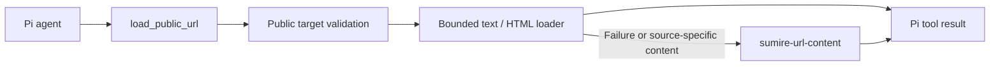

# Sumire URL Tool

Pi package that registers `load_public_url`. The agent decides when to fetch a URL; the extension does not intercept user input, prefetch links, or maintain pending URL state.

## Load from this repository

Run from the repository root:

```bash
npm ci
npm run build --workspace @narumitw/sumire-url-tool
pi -e ./packages/url-tool
```

The Pi manifest loads `dist/index.js`. Pi core libraries are peer dependencies; `@narumitw/sumire-url-content`, `ipaddr.js`, and `undici` are runtime dependencies. Browser-based fallbacks require Playwright Chromium and its system dependencies; the Sumire container provides them.

Pi packages execute with the current user's permissions. Review source before installation.

## Tool contract

```json
{ "url": "https://example.com/article" }
```

`load_public_url` returns readable text or Markdown plus source metadata in both text content and typed result details. Results include `url`, `finalUrl`, `source`, `contentType`, `text`, and `truncated`; optional fields include `title`, `status`, and `loaderId`. For the source-aware fallback, `finalUrl` remains the requested URL because that loader does not expose a final target.

Failures throw through Pi's native tool error path. Cancellation is passed to the loader. Fetched content is untrusted reference data, not instructions or authorization.



## Bounds and safety

- Defaults: HTTP and HTTPS, 15-second built-in/DNS phase timeout, 180-second source-aware timeout, and 12,000 extracted characters plus a truncation marker.
- Rejects URL credentials and local, private, link-local, metadata, or non-routable targets.
- Built-in requests pin validated DNS addresses, revalidate redirects, and cap response bytes and redirect count.
- Source-aware extraction retains the URL content package's public-target and network safety checks.
- No network requests or background resources start during extension registration.

## SDK configuration

```typescript
import { createUrlExtension } from "@narumitw/sumire-url-tool"

const extension = createUrlExtension({
  allowedSchemes: new Set(["https"]),
  maxChars: 12_000,
  timeoutMs: 15_000,
  urlContentTimeoutSeconds: 180,
})

// Pass to DefaultResourceLoader:
const extensionFactories = [{ name: "sumire-url-tool", factory: extension }]
```

All options are optional. The default export uses the defaults above. Hosts own configuration; the package does not read bot environment variables or depend on Telegram.

`createPublicUrlLoader(options)` and `createUrlTool(loader)` are also exported for hosts that need a standalone tool or an injected loader. The default extension and standalone tool register the same name; use only one per session.

## Checks

```bash
npm run format:check --workspace @narumitw/sumire-url-tool
npm run lint --workspace @narumitw/sumire-url-tool
npm run typecheck --workspace @narumitw/sumire-url-tool
npm test --workspace @narumitw/sumire-url-tool
```

Tests cover the compiled Pi manifest, registration, host configuration, cancellation forwarding, native tool errors, public-target validation, DNS pinning, output limits, and source-aware fallback.

## License

MIT
