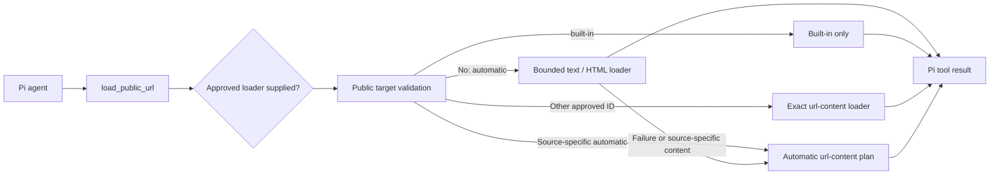

# Sumire URL Tool

Pi package that registers `load_public_url` and bundles the `load-public-url` skill. The agent decides when to fetch a URL; the extension does not intercept user input, prefetch links, or maintain pending URL state.

## Load from this repository

Run from the repository root:

```bash
npm ci
npm run build --workspace @narumitw/sumire-url-tool
pi -e ./packages/url-tool
```

The Pi manifest loads `dist/index.js` and `skills/load-public-url/SKILL.md`. Pi core libraries are peer dependencies; `@narumitw/sumire-url-content`, `ipaddr.js`, and `undici` are runtime dependencies. Browser-based fallbacks require Playwright Chromium and its system dependencies; the Sumire container provides them.

Pi packages execute with the current user's permissions. Review source before installation.

## Bundled skill

The `load-public-url` skill tells the agent when to call the tool, to preserve source attribution across multiple URLs, and to treat fetched content as untrusted. Pi discovers it through the package manifest. Hosts that load `createUrlExtension()` directly can bind the same bundled skill with the exported `urlToolSkillsPath`.

## Tool contract

```json
{ "url": "https://example.com/article" }
```

A host can expose an allowlisted exact override:

```json
{ "url": "https://example.com/article", "loader": "httpx" }
```

Omitting `loader` preserves automatic selection. `built-in` runs only the bounded text/HTML path; another approved ID runs exactly that `@narumitw/sumire-url-content` loader without automatic fallback. The tool schema contains `loader` only when the host configures at least one `selectableLoaders` entry, and execution enforces the same allowlist even if schema validation is bypassed.

`load_public_url` returns readable text or Markdown plus source metadata in both text content and typed result details. Results include `url`, `finalUrl`, `source`, `contentType`, `text`, and `truncated`; optional fields include `title`, `status`, and `loaderId`. For source-aware loading, `finalUrl` remains the requested URL because that loader does not expose a final target.

Failures, including unknown, disallowed, inapplicable, or unavailable explicit loaders, throw through Pi's native tool error path. Cancellation is passed to the loader. Fetched content is untrusted reference data, not instructions or authorization.

Threads post and Google Docs document links bypass the built-in HTML loader after public-target validation and use dedicated source loaders. Threads extraction verifies the post's canonical metadata and reads its public Open Graph text instead of accepting the JavaScript application shell. Google Docs requests a plain-text export instead of downloading the editor application. Known document filename extensions also go directly to source-aware loading: Office, OpenDocument, RTF, EPUB, and CSV links use local `anydoc` conversion unless an existing source-specific plan takes precedence; PDF links keep their existing PDF loader. No hosted OCR is enabled. Document failures retain their source error details and do not fall back to generic HTML; the normal output character limit still applies.



## Bounds and safety

- Defaults: HTTP and HTTPS, 15-second built-in/DNS phase timeout, 180-second source-aware timeout, and 12,000 extracted characters plus a truncation marker.
- Rejects URL credentials and local, private, link-local, metadata, or non-routable targets.
- Built-in requests pin validated DNS addresses, revalidate redirects, and cap response bytes and redirect count.
- Source-aware extraction retains the URL content package's public-target and network safety checks.
- No network requests or background resources start during extension registration.

## SDK configuration

```typescript
import { createUrlExtension, urlToolSkillsPath } from "@narumitw/sumire-url-tool"

const extension = createUrlExtension({
  allowedSchemes: new Set(["https"]),
  maxChars: 12_000,
  timeoutMs: 15_000,
  urlContentTimeoutSeconds: 180,
  selectableLoaders: ["built-in", "httpx", "playwright"],
})

// Pass both values to DefaultResourceLoader:
const extensionFactories = [{ name: "sumire-url-tool", factory: extension }]
const additionalSkillPaths = [urlToolSkillsPath]
```

All options are optional. The default export uses the loading defaults above and is auto-only; omitting `selectableLoaders` leaves `loader` out of the tool schema. Hosts should expose only loaders whose runtime dependencies, latency, and external costs they accept. Loader names are validated during extension registration, while missing requirements such as `FIRECRAWL_API_KEY` fail through the normal tool error path when selected. The package does not read bot environment variables or depend on Telegram.

`createPublicUrlLoader(options)` and `createUrlTool(loader, { selectableLoaders })` are also exported for hosts that need a standalone tool or an injected loader. `PublicUrlLoader.load` accepts `load(url, { signal, loader })`; injected implementations using the old positional `load(url, signal)` contract must migrate. The default extension and standalone tool register the same name; use only one per session.

## Checks

```bash
npm run format:check --workspace @narumitw/sumire-url-tool
npm run lint --workspace @narumitw/sumire-url-tool
npm run typecheck --workspace @narumitw/sumire-url-tool
npm test --workspace @narumitw/sumire-url-tool
```

Tests cover the compiled Pi manifest and bundled skill, registration, host allowlists, explicit and automatic routing, cancellation forwarding, native tool errors, public-target validation, DNS pinning, output limits, and source-aware fallback.

## License

MIT
